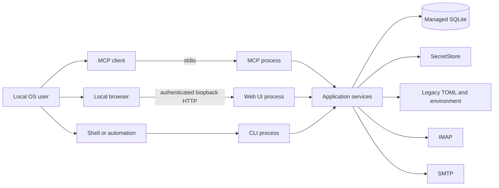
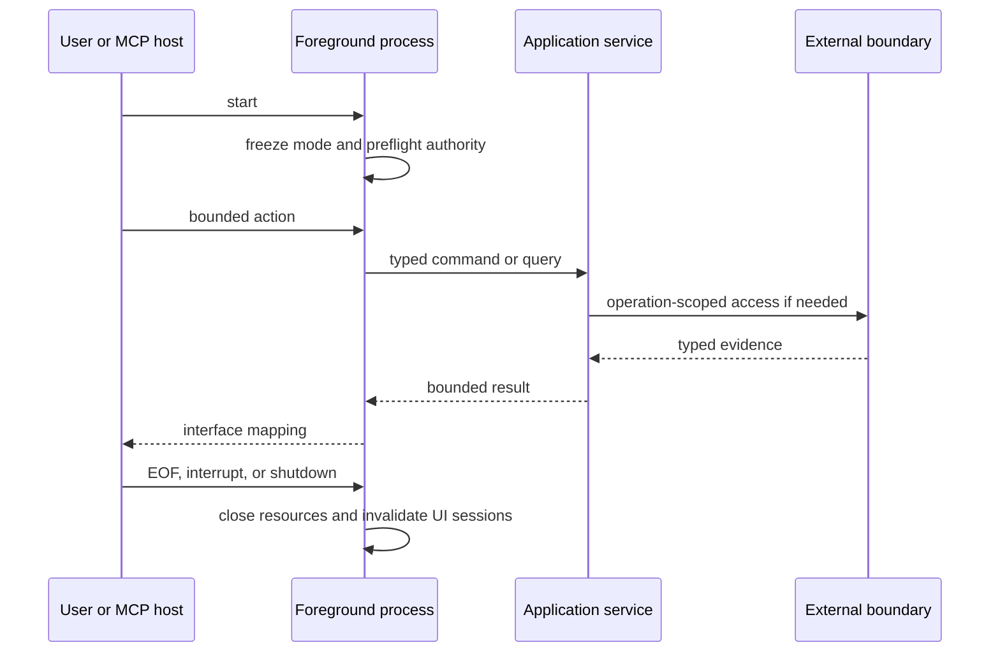

# 01. System Context

## Purpose

The Local Email App is a local, single-user application that connects MCP
clients and management interfaces to existing IMAP and SMTP providers. It is not
an email provider, hosted control plane, or mailbox replica. Providers remain
authoritative for mail; local state supplies explicit configuration, secure
credential references, and bounded observations.

## Actors and External Systems

### Local user

The operating-system user owns configuration choices, credential entry, and
local filesystem effects. The OS-user boundary alone does not authorize browser
or MCP requests; each interface applies its own validation and intent controls.

### MCP client

An MCP client invokes bounded mail workflows. Arguments may be model-generated
and are hostile input. Credentials and account-management operations MUST NOT
enter MCP in either mode. Historical secret-bearing account-add behavior is
removed and replaced by explicit handoff to interactive CLI or local Web UI.

### CLI and local browser

The CLI is the headless management, recovery, and automation surface. The local
browser is an untrusted client of a temporary loopback server. Browser
extensions, other local processes, copied URLs, DNS rebinding, cross-origin
pages, and stale tabs are threat inputs even on `127.0.0.1`.

### Providers

IMAP and SMTP servers are external systems. Their responses, mailbox names,
message content, MIME filenames, certificates, delays, and errors may be
malformed, adversarial, incomplete, or ambiguous.

## Process Model

There are three foreground process shapes:

1. `mcp-email-server stdio` is owned by its MCP host.
2. A management CLI command performs one bounded action.
3. `mcp-email-server ui` starts a temporary loopback ASGI server and exits when
   its foreground process stops.

No entry point starts a daemon or implicit background synchronizer. Startup
freezes bootstrap mode and the managed database path for that process. Managed
startup validates selected authority before serving. Application services MAY
be composed lazily after preflight; concrete mail and SQLite handles MAY remain
operation-scoped. Shutdown MUST be idempotent and close every resource actually
constructed.

## Goals

- Preserve compatible MCP mail workflows behind typed application services,
  except for intentional removal of secret-bearing account management.
- Provide complete CLI and graphical management planes for managed mode.
- Keep managed non-secret configuration in SQLite and secret values in a
  `SecretStore`.
- Resolve only the selected account's required provider-role secret immediately
  before provider construction.
- Reuse bounded metadata observations without claiming complete offline state.
- Preserve evidence for known success, known failure, and unknown effects.
- Bound interface input, provider and local work, serialized output, and errors.
- Ship a self-contained Web UI requiring no Node.js at install or runtime.

## Non-goals

- Hosted, remotely accessible, tenant, role, or multi-user operation.
- A daemon, background sync service, or full offline mailbox replica.
- Mail browsing, composing, or mutation in the management UI.
- MCP Apps or MCP-based account/credential management in this delivery.
- FTS, stored bodies, raw MIME, stored attachment payloads, or QRESYNC.
- Generic operation journals, leases, evidence ledgers, or continuity systems.
- Online backup/restore, hard purge, or exactly-once provider effects.
- Removal of existing HTTP transport compatibility without a separate decision.

## Trust Boundaries

### Interface input

MCP, CLI, and browser input MUST be validated in application services even when
an adapter framework also validates it. Direct callers MUST NOT bypass limits.

### Email content

Message content is untrusted data, never instructions. HTML email MUST NOT be
rendered as trusted UI. Provider strings in logs and errors MUST be normalized,
sanitized, and truncated.

### Local files

Bootstrap files, SQLite and its sidecars, legacy TOML, packaged assets, and
attachment destinations may be replaced, symlinked, or insecurely permissioned.
Their detailed contracts belong to specs 06, 08, and 09.

### Secrets

Secret values and reusable secret locators are sensitive. Values enter only
through protected CLI or authenticated UI flows, never MCP or an agent chat.
Their lifecycle belongs to spec 05; safe agent handoff belongs to spec 11.

### Browser boundary

Loopback reachability is not authentication. The UI requires one-time bootstrap,
a process-local session, CSRF defense, strict Host and Origin validation, and
secure response headers under spec 09.

## Failure Posture

- Invalid selected authority fails closed; managed mode never falls back.
- Policy denial precedes the protected provider or filesystem effect.
- Provider and local persistence effects are not falsely described as atomic.
- Known provider evidence survives projection or diagnostic failure.
- Ambiguous effects are not automatically replayed.
- Public errors expose no secret, message content, SQL, stack trace, or
  unintended local path and stay within bounded detail limits.

## Acceptance Criteria

1. Stdio, CLI, and loopback UI lifecycles are independently testable and none
   implies a daemon or remote service.
2. Managed startup fails before serving when selected authority is missing,
   insecure, corrupt, incompatible, or not active.
3. Browser, MCP, agent integration, provider-content, secret, and filesystem
   boundaries each have a named defense and an owning detailed spec.
4. Management UI routes contain no mail-client workflow; MCP contains no account
   or credential management; and no MCP App resource or metadata is delivered.
5. Startup, EOF, cancellation, interrupt, and normal exit leave no constructed
   process resource or UI session intentionally live.
