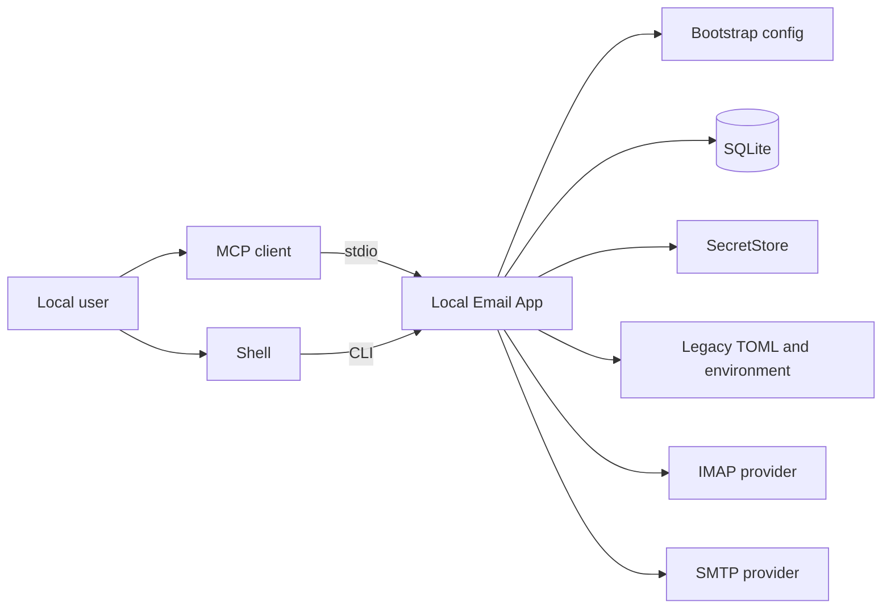
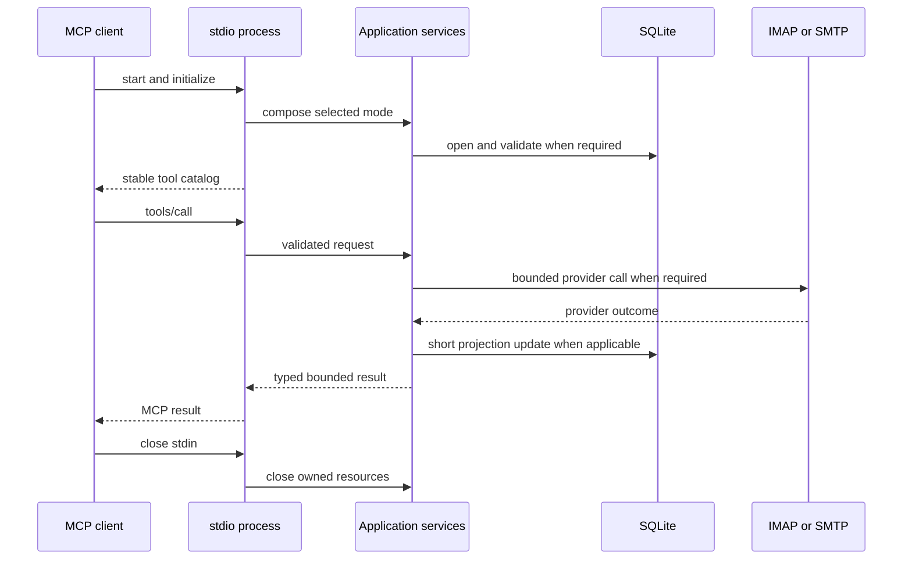

# 01. System Context

Status: Accepted

Previous: [`README.md`](README.md)
Next: [`02-application-boundaries.md`](02-application-boundaries.md)

## Purpose

The Local Email App connects one local user to existing IMAP and SMTP accounts.
It exposes mail workflows to MCP clients over stdio and trusted management
workflows through CLI. It is not a mail server: remote providers remain the
mail authorities, while local state improves management and bounded discovery.

## Actors and External Systems

The local user controls configuration and secret entry. MCP arguments and all
mail content are untrusted even though the process runs with the user's OS
identity.

## Goals

- Preserve existing mail behavior while separating interfaces from policy,
  persistence, secrets, and provider protocols.
- Let a managed account be configured through CLI and used through stdio MCP.
- Reuse a bounded metadata projection across local processes without claiming
  offline completeness.
- Keep credentials out of model-visible MCP input and ordinary SQLite rows.
- Bound provider request criteria, command time, subsequent local work, and every
  application result. Basic IMAP SEARCH may emit its UID list before cardinality
  is known; [`06-mcp-interface-and-client-compatibility.md`](06-mcp-interface-and-client-compatibility.md)
  defines that explicit residual limitation and the post-response scan ceiling.
- Make failure and ambiguous side effects explicit rather than inventing
  exactly-once guarantees.

## Non-goals

- Hosted, tenant, role, remote-authentication, or multi-user service behavior.
- A daemon or implicit background synchronizer.
- New HTTP or SSE architecture; current commands are compatibility behavior.
- Complete offline replication or interchangeable databases.
- A web UI or MCP App in the managed MVP.
- Generic distributed transaction, operation-journal, continuity, backup, or
  restore infrastructure.
- FTS, QRESYNC, persistent bodies, raw MIME, or attachment payloads by default.
- Exactly-once SMTP or IMAP effects after an ambiguous network failure.

## Process Model

An MCP client owns a single stdio subprocess. Startup resolves immutable
bootstrap settings, constructs one process-scoped runtime, and exposes a stable
tool catalog. Refresh happens only inside a request; no background loop starts.
CLI commands construct the same application services for the duration of the
command.

Startup behavior is deterministic:

- `legacy` loads the existing TOML/environment/keyring composition and may open
  a separate operational index store for read acceleration;
- `managed` requires an explicit database path and an active, compatible
  catalog; missing, corrupt, insecure, incompatible, or staging-only storage
  fails closed;
- there is no automatic mode detection or managed-to-legacy fallback;
- changing mode requires an explicit bootstrap write and process restart.

## Local Concurrency

SQLite may be shared by MCP and CLI processes. Transactions are short, use
revision checks where concurrent writes matter, and never contain mail,
secret-store, or long filesystem calls. A bounded busy timeout converts
contention into a typed failure or the documented read fallback; it does not
permit unbounded waiting. Startup and migrations acquire an explicit local lock
when exclusive schema ownership is required.

## Trust Boundaries

- MCP input is model-generated and validated as hostile input.
- Headers, bodies, HTML, MIME metadata, and filenames are provider-controlled.
- Provider responses may be malformed or incomplete.
- Bootstrap, TOML, environment values, database files, and parent directories may
  have unsafe ownership, permissions, symlinks, or replacement races.
- Secret-store identifiers are sensitive metadata even though they are not the
  secret value.

The application validates account policy before provider access, sanitizes
errors, confines attachment output to an approved workspace, and never echoes
secret values or sensitive local locators.

## Runtime Ownership

The composition root owns repositories, mail clients, and closeable resources
for the process lifetime. Application services use immutable operation-scoped
account snapshots. Account disablement is checked before every provider access;
configuration changes become visible at the next operation where supported.
Mode changes require restart and never replace the tool catalog in place.

## Related Specs

- Layering and service ownership: [`02-application-boundaries.md`](02-application-boundaries.md)
- Startup, lifecycle, and secrets: [`03-configuration-and-credentials.md`](03-configuration-and-credentials.md)
- Mail truth and uncertain outcomes: [`04-mail-workflows-and-consistency.md`](04-mail-workflows-and-consistency.md)
- SQLite behavior: [`05-sqlite-persistence-and-data-model.md`](05-sqlite-persistence-and-data-model.md)
- MCP compatibility: [`06-mcp-interface-and-client-compatibility.md`](06-mcp-interface-and-client-compatibility.md)
