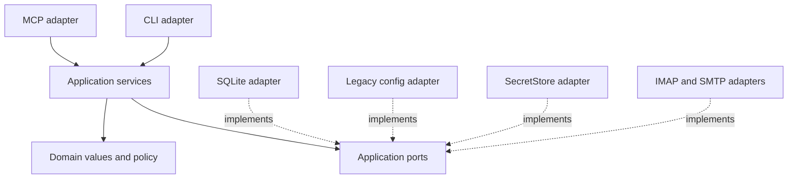

# 02. Application Boundaries

Status: Implemented

Previous: [`01-system-context.md`](01-system-context.md)
Next: [`03-configuration-and-credentials.md`](03-configuration-and-credentials.md)

## Design Principle

One application command or query owns each user action. MCP and CLI translate
transport input into application DTOs and translate typed results back; they do
not implement policy, persistence, secret resolution, provider sequencing, or
fallback decisions.

## Layers

Domain and application modules do not import FastMCP, Typer, Gradio, sqlite3,
keyring, aioimaplib, or aiosmtplib. Concrete adapters may depend inward on
application contracts. Compatibility wrappers may temporarily call a service,
but no new service calls an old MCP handler.

## Composition Root

One process-scoped composition root:

1. reads and validates bootstrap mode;
2. constructs either the legacy catalog adapter or managed SQLite catalog;
3. opens the operational index when the selected mode permits it;
4. constructs `SecretStore`, IMAP, SMTP, repositories, policy, and services;
5. injects services into the MCP or CLI adapter;
6. closes mail sessions, repositories, locks, and database resources on exit.

Construction failure in managed mode aborts startup. In legacy mode, failure of
the optional operational index may degrade indexed reads to the bounded
provider path through the same query service; it does not bypass the service.

## Application Services

The MVP uses workflow-specific services rather than a generic command engine:

- bootstrap and managed-catalog lifecycle;
- account create, list, show, update, disable, re-enable, and soft removal;
- credential candidate write, activation, rotation, cleanup, and doctor;
- connectivity validation and explicit legacy import;
- effective-account and capability resolution;
- mailbox discovery;
- metadata listing and bounded refresh;
- body and attachment retrieval;
- mark-read, save, move, archive, delete, send, and sent-copy workflows.

Services may share small domain values and policy functions. They do not share a
universal operation/attempt/evidence framework. A workflow may persist narrow
recovery state only when its own replay analysis requires it.

## Ports

Add a port only for a current external boundary, a current second
implementation, or a deterministic test seam. Expected MVP boundaries are:

| Boundary           | Responsibility                                                |
| ------------------ | ------------------------------------------------------------- |
| Bootstrap settings | read/write explicit mode and managed DB path                  |
| Account catalog    | resolve and revise non-secret account configuration           |
| Operational index  | mailbox, placement, metadata, and coverage projection         |
| Secret store       | immutable candidate write, read, and best-effort delete       |
| IMAP gateway       | bounded discovery, search/fetch, append, flags, move/delete   |
| SMTP gateway       | bounded message submission and recipient outcomes             |
| Clock/ID source    | deterministic revisions, timestamps, and binding IDs in tests |
| Artifact workspace | confined attachment output only when requested                |

Do not create ports for deferred UI, remote transport, alternate SQL engines,
backup, generic scheduling, or hypothetical providers.

## Request Boundary

For each request, the application service:

1. validates syntax and explicit size limits;
2. resolves an enabled operation-scoped account snapshot;
3. evaluates sender, recipient, mailbox, and path policy before provider access;
4. resolves secrets as late as possible and does not retain them in DTOs;
5. performs network work outside database transactions;
6. persists only the workflow's known observation or reconciliation state;
7. returns a typed outcome that preserves partial or unknown results.

The adapter maps expected errors to bounded public errors. Unexpected exceptions
are logged without secrets or message content and returned without internal
paths, SQL, provider credentials, or secret locators.

## Account Snapshot

A provider operation receives one immutable effective account snapshot with:

- stable operational account ID and display name;
- enabled state and revision;
- inbound and optional outbound endpoint values;
- sender/recipient/mailbox/path policy needed by that operation;
- capabilities known from configuration or current provider negotiation;
- opaque secret bindings resolved through the secret port.

Legacy/environment and managed sources normalize to this DTO. Index activity may
associate a stable operational ID with a legacy source, but must never copy a
legacy endpoint, policy, or secret into managed configuration.

## Transactions and Concurrency

SQLite transaction ownership stays inside repository/application boundaries.
No transaction crosses MCP or CLI mapping code. Optimistic revision checks reject
stale catalog writes. Provider calls do not hold database locks. If a provider
effect succeeds and local projection update fails, the public result reports the
known provider outcome and a stale/reconciliation warning; it does not claim
rollback.

## Compatibility Migration

A public path is considered migrated only when its adapter calls an application
service and the prior direct handler bypass is removed. During migration:

- old response models and strings remain at the adapter boundary when required;
- legacy configuration behavior remains behind a catalog adapter;
- provider fallback is an explicit application decision, not an MCP shortcut;
- unreachable production kernels and ports are removed before a phase closes.

## Testing Boundaries

- Domain tests cover values and policy without I/O.
- Service tests use typed fake ports and exercise success, denial, partial, and
  ambiguous outcomes.
- Adapter tests cover SQLite, SecretStore, IMAP, SMTP, and filesystem behavior.
- Contract tests freeze CLI and MCP schemas and result mapping.
- GreenMail E2E starts the real stdio server and proves supported provider paths,
  including failure and scoped-mutation safety boundaries.

## Implementation Evidence

Account and policy queries, managed lifecycle and import commands, metadata,
mailbox discovery, body retrieval, attachment retrieval, compose, and every
mutation enter typed application services from thin MCP or CLI adapters. The
services receive narrow authority, provider, projection, secret, management, and
artifact ports and own lifecycle revalidation, bounds, policy, replay decisions,
index invalidation, and compatible result mapping.

Concrete legacy/managed configuration, `ClassicEmailHandler`, SQLite, keyring,
and filesystem construction live in local adapters assembled by
`mcp_email_server.runtime`. The former production dispatcher was removed; MCP
and CLI contain no direct mail-handler or managed-catalog bypass. Runtime
lifespan shutdown closes and discards cached application resources. Service tests
use injected fakes, while adapter, provider, SQLite, MCP contract, lifecycle,
and GreenMail stdio tests cover the concrete boundaries and same-process
lifecycle changes.
