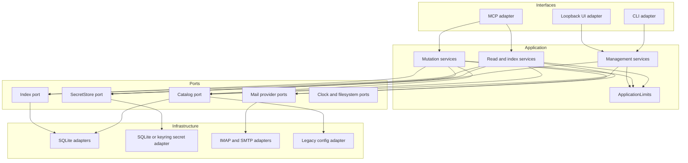
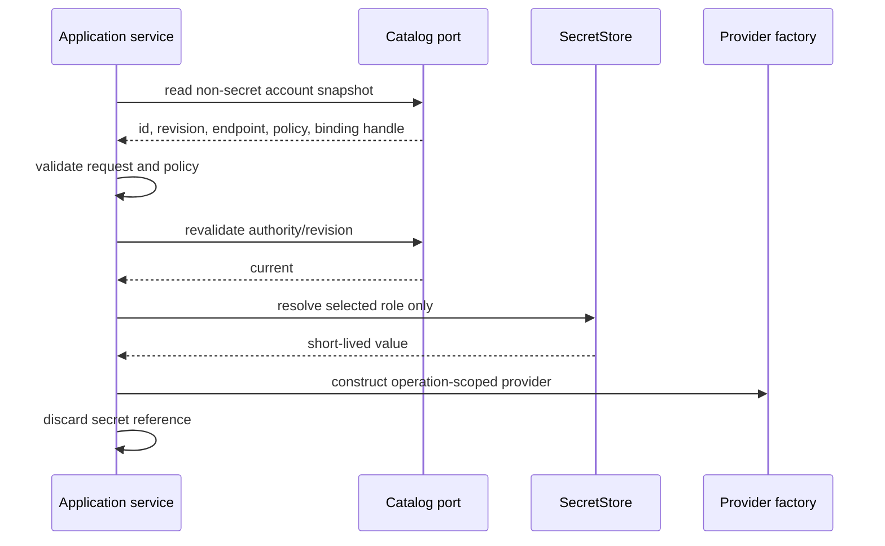

# 03. Application Architecture

## Design

The application follows ports and adapters. Interface adapters parse and map;
application services own use-case orchestration and bounds; domain types own
meaning; infrastructure adapters own external protocols and persistence.

Dependencies point inward. Application and domain code MUST NOT import CLI, MCP,
Starlette, React, concrete SQLite, keyring, or concrete mail clients.

## Interface Adapters

MCP, CLI, and Web UI adapters MUST:

- validate syntax and map framework objects to typed commands/queries;
- authenticate and enforce interface-specific controls where applicable;
- call one application service entry point;
- map typed results to bounded interface responses;
- avoid direct calls to `Settings.store()`, `ManagedCatalog`, SQLite, keyring,
  concrete provider clients, or global mutable configuration.

MCP adapters expose only mail workflows. They MUST NOT expose account, policy,
credential, import, doctor, or other management services. Management remains
available through CLI and authenticated local Web UI application services.

## Application Services

Application services own:

- cross-field validation and canonicalization;
- current account selection and lifecycle checks;
- expected-revision and conflict behavior;
- effective policy and capability checks;
- limit enforcement for direct and adapted calls;
- external-effect ordering;
- typed provider outcome mapping;
- projection updates and warning preservation;
- cancellation checkpoints before irreversible effects.

They return immutable bounded DTOs and do not expose infrastructure exceptions.
Management CLI and UI invoke the same service methods, so UI validation cannot
be weaker or semantically different.

## Ports

Required abstract capabilities include:

- bootstrap and selected-authority inspection;
- managed catalog queries and compare-and-swap mutations;
- legacy effective configuration and legacy-only writer;
- `SecretStore` immutable store/read/delete, including transactional insertion
  for the Linux managed SQLite implementation;
- IMAP mailbox, metadata, body, attachment, append, move, and flag operations;
- SMTP delivery;
- metadata projection queries and writes;
- safe filesystem materialization;
- clock, entropy, and cancellation/deadline hooks where deterministic testing
  requires them.

Ports expose domain/application types and typed errors, not framework responses.

## Operation Snapshots and Late Secrets

A managed operation first reads a non-secret snapshot containing only:

- stable account identifier and current revision;
- lifecycle and selection state;
- non-secret endpoint data;
- effective policy and bounded capability preferences;
- opaque binding status/handle needed by the secret resolver.

It MUST NOT call a settings loader that resolves every enabled account's secret.
Immediately before provider construction, the operation revalidates current
account authority and resolves only the selected account's required role
(`imap`, `smtp`, or both when explicitly needed). A read failure for account B
cannot prevent an operation on account A.

Secret values are handed directly to the provider factory through a short-lived
internal value, not placed in DTOs, process-wide settings, caches, diagnostics,
or repr output. Doctor may explicitly inspect a bounded set of binding statuses
and attempt bounded resolution, but it must not return values.

## Composition and Lifecycle

`bootstrap` determines and freezes mode and validates selected authority.
`runtime` composes stateless/cached service objects lazily and injects concrete
ports. It does not falsely claim ownership of long-lived handles that are
operation-scoped. Any cache has explicit ownership, contains no raw secrets, and
is cleared at shutdown.

Provider and database handles use context-managed operation scopes unless a
measured design justifies wider ownership. `aclose()` is idempotent and closes
all constructed resources. Startup failure unwinds already-created resources in
reverse order.

## Transactions and External Effects

SQLite transactions contain only bounded local database work. Network, system
keyring, browser opening, and potentially large filesystem effects happen outside
them. The Linux managed `SecretStore` is the deliberate exception: inserting a
row into the same database's dedicated `managed_secret` table and activating its
binding/revision are one bounded SQLite transaction. Workflows spanning an
external keyring boundary use explicit phases and typed cleanup states rather
than claiming cross-store atomicity.

A credential mutation follows:

1. validate and canonicalize outside a write transaction;
2. read current revision and plan bounded work;
3. for a keyring-backed store, write the immutable new value outside SQLite;
4. compare-and-swap activation and mark any superseded active value
   cleanup-required; on Linux, insert the secret in this same transaction;
5. on any pre-activation failure, return an error with binding authority
   unchanged and retain no provisional binding;
6. delete the superseded value outside the activation transaction and clear its
   cleanup state after success;
7. return active, cleanup-required, conflict, or failed unchanged-authority
   explicitly.

## Shared Limits

A single immutable `ApplicationLimits` value owns cross-interface ceilings.
Domain-specific specs name their limits; adapters MAY impose stricter transport
ceilings but MUST NOT expand them. Limits cover request collections and strings,
mailbox and candidate counts, body/attachment bytes, mutation batches,
concurrency, timeout/deadline, database rows, error details, and aggregate
serialized results.

## Local Oversized-Result Handoff

Because every supported transport is a local single-user process, a bounded
application workflow MAY spill an otherwise valid result that exceeds the
inline serialized-result ceiling into a process-owned temporary artifact. This
is an explicit result variant, not an exception to provider/request limits:

- provider work, item counts, individual fields, and aggregate raw bytes remain
  bounded before spill;
- the artifact directory is allocated lazily on the first spill write, randomly
  named, owner-only, process-scoped, and outside the
  repository/configuration/catalog trees;
- files are created no-follow and exclusive with owner-only permissions, have a
  bounded byte size and integrity digest, and are revalidated after write;
- the inline DTO contains only a bounded preview/status, exact artifact path,
  media type, byte count, digest, and process-lifetime notice;
- no generic file-read, file-listing, download route, or remote URL is added;
  an already-authorized local MCP host may inspect the returned path through its
  own filesystem capability;
- graceful shutdown removes artifacts and their private directory; startup MAY
  perform bounded, ownership-verified cleanup of stale crash remnants;
- secret values are never eligible for spill, while message content retains the
  same local sensitivity classification as an inline result.

A spill failure or unsupported filesystem platform returns a typed bounded
error and never falls back to an oversized protocol response. Spill capability
is optional at runtime: its absence does not disable bounded inline reads or the
management plane. CLI/UI use this variant only for workflows that already expose
the same content; the management UI does not gain mail access.

## Error and Cancellation Rules

Infrastructure errors map once to typed application errors. Public adapters
sanitize and bound messages. Cancellation is checked before effects and between
independent targets. Once an effect begins, the service preserves available
protocol evidence and reports unknown when cancellation prevents certainty.

## Acceptance Criteria

1. Architecture/import tests prevent interface frameworks and infrastructure
   implementations from entering application/domain modules.
2. MCP, CLI, and UI adapters contain no direct managed-catalog, settings-write,
   keyring, or concrete mail-client orchestration.
3. An operation on account A never resolves account B's secret, and a broken B
   binding does not block A.
4. Operation snapshots, caches, DTOs, repr output, and exceptions contain no raw
   secret.
5. Direct application calls and all three adapters enforce the same limits and
   validation semantics.
6. Network, system-keyring, and attachment writes do not execute inside SQLite
   transactions; the Linux `managed_secret` insert is atomic with binding
   activation and revision.
7. Lazy composition, startup unwind, operation scopes, and repeated shutdown are
   covered without claiming nonexistent long-lived ownership.
8. Architecture and catalog tests prove no MCP adapter or service registration
   path exposes account or credential management in either mode.
9. Oversized-result tests prove bounded inline output, private no-follow
   artifacts, digest/size integrity, process cleanup, spill-failure behavior, and
   absence of a generic file or remote-download surface.
