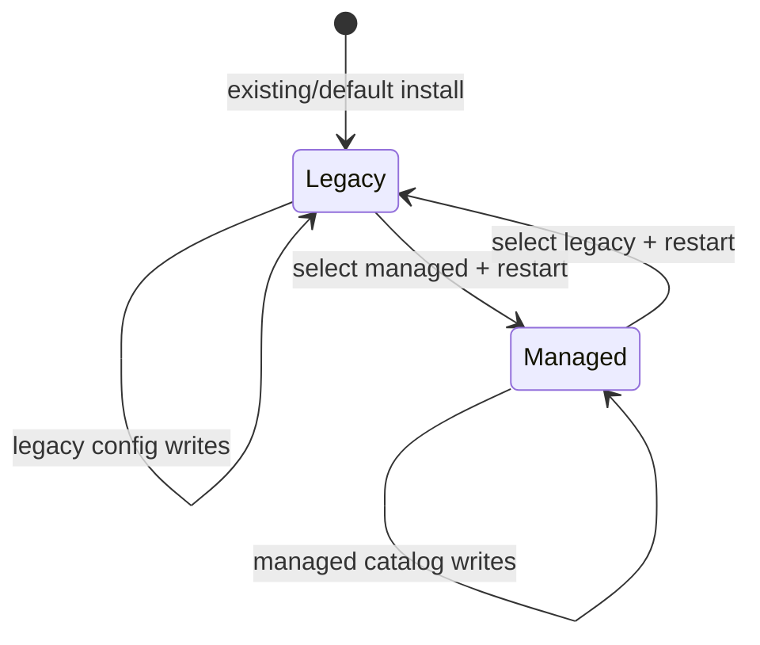
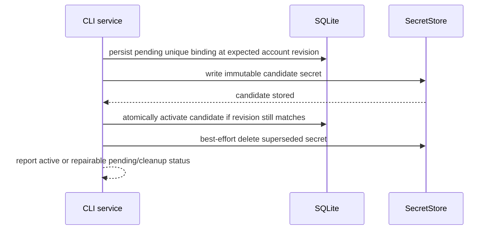

# 03. Configuration and Credentials

Status: Implemented

Previous: [`02-application-boundaries.md`](02-application-boundaries.md)
Next: [`04-mail-workflows-and-consistency.md`](04-mail-workflows-and-consistency.md)

## Ownership

Configuration has one authority per mode:

| Source                  | Role                                                              |
| ----------------------- | ----------------------------------------------------------------- |
| Bootstrap configuration | explicit `legacy` or `managed` mode and managed DB path           |
| Legacy TOML             | authoritative stored account configuration in legacy mode         |
| Environment             | read-only process overlay and environment-defined legacy accounts |
| Managed SQLite catalog  | authoritative non-secret account configuration in managed mode    |
| SecretStore             | authoritative managed secret values                               |

Managed mode does not treat TOML account rows as an active catalog. Environment
may override documented process/bootstrap settings, but it cannot mutate the
managed catalog or silently widen durable security policy.

## Explicit Mode Selection

Managed selection is always explicit. For backward compatibility, a missing
bootstrap file or a parseable pre-managed configuration with no `mode` field has
the defined effective mode `legacy`; this is the only implicit selection. Every
new bootstrap write persists a format version and an explicit `legacy` or
`managed` value. An invalid or unparseable existing bootstrap fails rather than
being treated as absent. Selecting managed mode requires an explicit database
path and a committed `ACTIVE` catalog.

`config select managed` first observes a valid active catalog, then atomically
writes bootstrap selection. It does not activate the database. If a persisted
managed selection names a database that later becomes missing, insecure,
corrupt, incompatible, or non-active, startup fails closed with remediation; it
never falls back to TOML. Deliberate deletion of the entire bootstrap returns the
installation to the documented unconfigured legacy default; it is not treated as
continuation of a now-unobservable managed selection. Mode changes take effect
only after restart.

There is no activation marker, nonce, continuity ledger, orphan scan, or
automatic mode inference.

## Managed Catalog Lifecycle

A new catalog starts as `STAGING`. The supported setup sequence is:

1. `config init` creates a secure staging database;
2. CLI creates an account and candidate secret bindings;
3. connectivity checks run outside SQLite transactions;
4. `config activate` validates the complete snapshot and atomically marks it
   `ACTIVE`;
5. `config select managed` writes bootstrap selection;
6. the user restarts MCP/CLI processes.

Activation requires at least one enabled, uniquely named account with a valid
inbound endpoint and active inbound credential. Outbound endpoint and credential
must either both be absent or both valid. All required policy values must be
materialized and valid. Activation never changes bootstrap mode in the same
multi-store action.

After activation, supported commands update accounts with optimistic revisions.
Disablement takes effect before any subsequent provider access. Soft removal
retains operational identity and cleanup state; hard purge is deferred.

## Managed Secret Bindings

Secret values never enter ordinary argv options. CLI accepts them from a masked
prompt, stdin/file descriptor, or another documented one-shot input. Ordinary
JSON, doctor, logs, MCP results, and errors expose only bounded status codes.
They do not expose values, local paths, backend account names, candidate
locators, or versions.

A credential create or rotation uses this narrow protocol:

The active secret is never overwritten or deleted before the replacement is
committed. Older pending candidates are atomically claimed as cleanup-required
before external deletion, so a concurrent candidate cannot become active after
cleanup selected its locator. A failed secret write leaves a
resumable/discardable pending binding.
A failed DB activation leaves the old binding active and the candidate eligible
for doctor-assisted cleanup. A post-commit cleanup failure does not invalidate
the new active secret and is reported without locator disclosure.

Managed mode requires a backend that supports independently addressable,
immutable candidates. It never silently falls back to plaintext.

## CLI Management Contract

The managed release provides commands for:

- initialize and inspect a catalog;
- add, list, show, update, disable, re-enable, and soft-remove accounts;
- set or rotate inbound/outbound credentials through safe input;
- test inbound and outbound connectivity;
- activate staging configuration;
- select legacy or managed mode;
- diagnose schema, account, binding, permissions, and cleanup state;
- explicitly import supported legacy accounts and credentials.

Commands have human-readable output and bounded machine-readable output where
supported. Neither form contains secrets or sensitive locators.

## Legacy Compatibility and Writer Fence

Legacy mode preserves current TOML/environment precedence, keyring behavior,
credential migration, reset, MCP account-add, and Gradio behavior unless a
separate public change is documented.

Before managed selection is available, every legacy writer in MCP, CLI, Gradio,
reset, credential migration, config helpers, and package entry points must have
an explicit managed-mode behavior. It either routes to a managed application
service or rejects before any TOML/keyring mutation with actionable guidance.
No managed operation may partially write a legacy store.

Environment overlays remain read-only. An environment-derived account may use a
stable non-secret operational identity for indexing, but is not imported into
managed configuration implicitly.

## Explicit Legacy Import

Import is a CLI workflow, never startup side effect. It:

1. reads the stored legacy source without process overlays unless explicitly
   requested by a separately named option;
2. validates names, endpoints, policy, and destination conflicts;
3. previews non-secret actions without writing;
4. writes managed rows and secret candidates through the same account/binding
   services used by manual setup;
5. leaves legacy source data unchanged;
6. reports per-account success or repairable failure;
7. does not select managed mode or activate an incomplete catalog automatically.

Repeated import is deterministic: existing matching accounts are reported,
conflicts require user resolution, and no credential is overwritten in place.
Credential resolution verifies that the stored non-secret account snapshot still
matches the plan; source changes fail and require a new preview before any
account write can combine old endpoint data with a new secret.

## Filesystem Security

Managed SQLite files, WAL/SHM sidecars, locks, bootstrap files, and parent
directories are owner-only. Creation uses restrictive permissions from the
start. The implementation rejects unexpected ownership, group/world access,
symlinked database paths, non-regular files, unsafe parents, and detectable
replacement races. Atomic bootstrap writes fsync the file and parent directory
where supported.

Failure to use the selected SecretStore or secure filesystem is fatal in managed
mode. Diagnostics identify the category and remediation without leaking paths
beyond what the user explicitly supplied.

## Implementation Evidence

Explicit bootstrap selection, secure `STAGING`/`ACTIVE` lifecycle, manual setup,
account list/show/update/disable/re-enable/soft removal, connectivity testing,
immutable candidate rotation and detachment, bounded doctor/cleanup, legacy
writer fences, and selected-mode MCP resolution are implemented through shared
management services. Optimistic revisions protect lifecycle and endpoint writes;
soft removal retains operational identity and cleanup state.

Legacy import is preview-first and reads stored TOML without environment overlays
or preview-time secret access. Confirmed apply is staging-only, conflict-first,
deterministic on repeat, resumable for missing bindings, and leaves the source
unchanged. Cleanup atomically claims stale pending bindings before external
deletion and never targets active bindings. Unit, adapter, CLI contract, runtime,
and loopback GreenMail stdio E2E cover lifecycle changes, rotation, import, and
fail-closed boundaries.

## Validation

Tests cover bootstrap defaults and overrides, explicit selection, every
activation crash boundary, restart behavior, revisions, account disablement,
secret write/activation/cleanup failures, secure-file checks, import conflicts,
writer fencing, redaction, and absence of managed-to-legacy fallback. GreenMail
E2E proves setup, restart, connectivity, managed stdio use, rotation, disablement,
and explicit import where provider behavior is involved.
