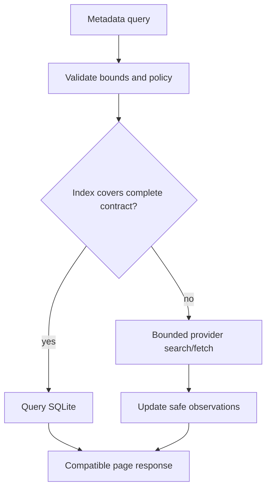
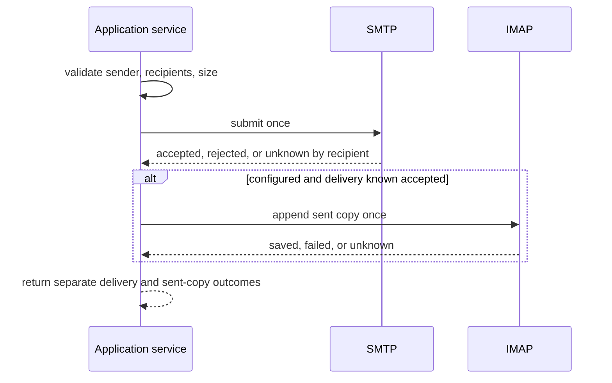

# 04. Mail Workflows and Consistency

Status: Accepted

Previous: [`03-configuration-and-credentials.md`](03-configuration-and-credentials.md)
Next: [`05-sqlite-persistence-and-data-model.md`](05-sqlite-persistence-and-data-model.md)

## Authority and Identity

IMAP is authoritative for mailbox membership, metadata, and flags. SQLite stores
bounded observations. A placement identity is:

`operational account ID + mailbox identity + UIDVALIDITY + UID`

An IMAP UID alone is not durable. RFC `Message-ID` assists threading and
reconciliation but is neither required nor globally unique.

## Metadata Listing

The existing `list_emails_metadata` public contract is retained. One application
query owns both index use and provider fallback.

The query may use SQLite only when indexed coverage can satisfy the complete
request, including all filters, ordering, requested page, sender policy, and the
exact filtered `total`. Otherwise it performs a bounded provider query. In
particular, unsupported `body`, `text`, or `has_attachment` filtering uses the
provider path until indexed data can prove the same result.

Provider fallback is owned by the application service, not by the MCP handler.
The same query service supports managed and legacy accounts. Legacy operational
index failure may degrade to provider access with a bounded warning; managed
catalog failure remains fail closed.

## Bounded Refresh and Coverage

The first indexed path discovers one mailbox and refreshes a configured recent
UID window. It stores scalar metadata and canonical provider-observed flags.
Internal keyset order is deterministic by UID descending (or ascending when the
public request requires it), with a fixed maximum page size.

- Partial coverage is explicit and never claims mailbox completeness.
- Partial refresh never infers provider removal from absence; local retention may
  evict rows outside the explicitly observed recent window.
- UIDVALIDITY change invalidates the affected projection before reuse.
- Removal by absence requires a complete matching-UIDVALIDITY reconciliation or
  explicit provider/mutation evidence.
- Sender allowlist filtering occurs before exposure and before public totals.
- New arrivals must not create duplicates or unstable internal continuations.

A future cursor-native public tool requires a versioned proposal; it does not
replace current page/page-size semantics in the MVP.

## Mailbox, Body, and Attachment Reads

Mailbox discovery is bounded and records remote name, delimiter, attributes,
UIDVALIDITY when available, and observation time. Provider mailbox names are
quoted and validated by the mail adapter.

Body retrieval remains provider-direct and bounded and always uses IMAP PEEK.
When `mark_as_read=true`, successfully retrieved UIDs then enter the application
mark-read workflow as a separate effect with fresh authority resolution and
projection invalidation. A mark failure never discards retrieved bodies. Batch
results preserve requested count, retrieved count, and failed IDs.

Attachment discovery and download remain provider-direct. Filenames are
untrusted, output is confined to an approved private workspace, writes are
bounded and collision-safe, and the result exposes only the compatible path
information required by the current public API. No persistent attachment or raw
MIME store is required.

## Mutation Rules

Every mutation resolves an enabled account and current mailbox identity,
validates allowlists and bounds immediately before provider access, and returns
per-target results in input order. Known provider success is not rewritten as
failure because a local projection update failed; instead the projection is
marked stale or a bounded warning is returned.

A scoped delete or move fallback must use native `UID MOVE` or `UID EXPUNGE`.
If neither scoped primitive is available, it rejects before marking target
messages `\Deleted` or before copying in a fallback that cannot safely expunge.
No product path calls bare mailbox-wide `EXPUNGE` for a scoped request.

## Workflow-specific Outcome Decisions

There is no generic operation engine. Each effect has an explicit replay rule:

| Workflow      | Known success                                                                                  | Ambiguous provider result                                               | Automatic replay |
| ------------- | ---------------------------------------------------------------------------------------------- | ----------------------------------------------------------------------- | ---------------- |
| Mark read     | requested UIDs accepted; flag projection becomes stale until canonical refresh                 | return unknown per affected target                                      | no               |
| Save/APPEND   | return provider UID when available; otherwise known append success without invented UID        | return unknown; do not append again                                     | no               |
| Native move   | report moved targets and invalidate source/destination observations                            | return unknown per affected target                                      | no               |
| Move fallback | COPY success plus scoped source expunge are separate facts; partial result is preserved        | report which substep is unknown; never infer rollback                   | no               |
| Delete        | scoped deleted/expunged targets are reported; unsupported scoped expunge fails before mutation | return unknown if effect boundary was crossed                           | no               |
| SMTP send     | preserve accepted, rejected, and unknown recipients                                            | accepted/unknown recipients are not resubmitted                         | no               |
| Sent copy     | reported independently from SMTP delivery                                                      | reconcile using narrow message evidence before any user-requested retry | no               |

Narrow durable state is permitted only when a workflow demonstrates a restart
reconciliation requirement, such as distinguishing successful SMTP delivery
from an uncertain sent-copy APPEND. It stores the minimum bounded evidence and
must not become a universal attempt, lease, evidence-capacity, or continuity
framework.

## Send and Sent-copy

Recipient policy is evaluated before SMTP. The result distinguishes accepted,
rejected, and uncertain recipients. If SMTP succeeds and sent-copy APPEND fails
or is unknown, delivery remains successful and the sent-copy outcome is reported
separately. Retrying the whole send is never the repair action.

## Cancellation and Errors

Cancellation before provider access has no remote effect. Cancellation or I/O
failure after a side effect may have started returns unknown unless the provider
supplies definitive evidence. The application never retries an ambiguous
mutation automatically. Provider errors are sanitized and bounded; server text,
message content, credentials, and local internals are not echoed blindly.

## Implementation Progress

Effective account listing now reloads selected-mode authority through a small
application service. The metadata listing workflow is implemented through one
injected application query service assembled by the process-scoped composition
root. The MCP adapter creates a typed query and no longer dispatches this tool
directly to `ClassicEmailHandler`. The first indexed subset is intentionally conservative:
unfiltered one-mailbox pages can use complete SQLite coverage after a provider
state probe; provider-specific text/date/address matching, mutable flag filters,
body/text search, and attachment heuristics remain on the application-owned
bounded IMAP fallback.

A full mailbox of at most 1,000 messages can establish complete coverage only
when matching provider state observations bracket the refresh. Larger mailboxes
retain a partial recent UID window, evict older local rows, and cannot answer the
public exact total. Provider fallback rejects more than 10,000 matching
candidate UIDs. SEARCH results must contain unique canonical single UIDs in the
IMAP UID range; range/set syntax, zero, duplicates, and overflow are rejected
before any FETCH. Full and From-only allowlist metadata headers use partial IMAP
fetches limited to 64 KiB each and 4 MiB total per logical query or refresh;
each wire FETCH is sized below that ceiling. Missing, duplicate, or mismatched
sender or INTERNALDATE observations fail instead of producing an inexact total
or UID-substituted ordering. Provider transport failures map to fixed bounded
application errors. Header refresh and body retrieval use PEEK forms and therefore do not
mark messages read.

Mark-read, save/APPEND, move, archive, delete, SMTP delivery, and Sent-copy now
run through injected workflow services. The classic provider adapter returns
per-target succeeded/failed/unknown evidence and never replays an ambiguous
effect. Services re-resolve selected-mode authority before every independent
provider effect, including archive discovery-to-move and SMTP-to-Sent-copy
boundaries. Known or possible effects invalidate only affected mailbox coverage;
a projection failure adds reconciliation status without replacing provider
evidence. Public all-known-success strings remain unchanged, while partial and
ambiguous results use the accepted tagged-text mapping.

## Validation

Tests cover index eligibility and fallback, exact filtered totals, every current
metadata filter, UIDVALIDITY invalidation, bounded partial-window eviction, PEEK, account and
sender policy, scoped expunge, concurrent unrelated `\Deleted` messages,
per-target ordering, partial move, ambiguous APPEND/SMTP outcomes, sent-copy
separation, and restart behavior for any workflow-specific durable state.
GreenMail E2E exercises real stdio requests and provider capabilities rather
than only calling mail helpers directly.
