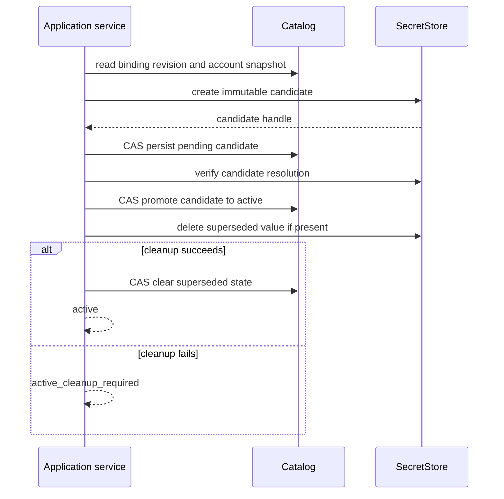

# 05. Credentials and Secret Lifecycle

## Security Objective

Managed secret values are owned only by a `SecretStore`. SQLite stores
revisioned binding lifecycle and opaque internal references required to locate a
value; it never stores the value. No plaintext fallback is allowed when the
store is unavailable.

## Sensitive Data Classification

The following are sensitive:

- passwords, app passwords, access/refresh tokens, client secrets, and private
  keys;
- values returned by `SecretStore`;
- candidate values supplied during set, rotation, or import;
- reusable backend locator strings when disclosure would help retrieve a value.

Sensitive data MUST NOT appear in:

- managed SQLite columns, migration files, or projection rows;
- MCP schemas, arguments, results, resources, or protocol logs;
- CLI argv, shell history guidance, stdout, or ordinary logs;
- UI URLs, fragments after bootstrap exchange, HTML, JSON responses, browser
  local/session storage, caches, telemetry, or error text;
- application/domain DTOs, repr/equality output, exception messages, test
  snapshots, crash reports, or process-wide settings caches.

Masked placeholders are display-only and are never submitted as values.

## Secret Input Surfaces

Managed values may enter only through:

- an interactive masked CLI prompt or an explicitly documented stdin/FD path
  that does not echo or place the value in argv; or
- an authenticated, CSRF-protected UI JSON mutation body over loopback.

The UI clears credential component state after submission and on navigation or
failure. Responses report state (`configured`, `missing`, `cleanup_required`)
but never return the submitted value.

MCP has no secret input in either mode and exposes no account-management tool.
The historical credential-bearing MCP account-add field is removed. Agent
skills/plugins MUST hand the user to interactive CLI or authenticated local UI
without asking for, receiving, or relaying the value.

## SecretStore Port

The port provides bounded operations to:

- create an immutable candidate and return an opaque internal handle;
- resolve a specific handle;
- delete a specific candidate/value;
- report typed unavailable, missing, denied, malformed, and transient failures.

Implementations MUST avoid value enumeration and broad lookup. Application code
MUST NOT infer success from backend-specific exception strings.

## Late Resolution

Provider work follows this order:

1. read the selected account's non-secret snapshot;
2. validate request, lifecycle, policy, endpoint, and role;
3. immediately before provider construction, revalidate authority/revision;
4. resolve only the binding for that account and required role;
5. construct the operation-scoped provider and release the application's value
   reference as soon as practical.

Loading settings MUST NOT resolve all enabled accounts. A missing or denied
secret for one unrelated account cannot break startup or an operation on another
account. Startup validates binding metadata; doctor may explicitly resolve a
bounded chosen set.

## Binding Lifecycle

Each endpoint-role binding has revisioned status, conceptually:

```text
missing
pending(candidate)
active(current)
active(current) + superseded(cleanup required)
pending repair required
```

Concrete storage may normalize these states, but transitions and recovery must
remain observable without exposing handles publicly.

## Set and Rotate Protocol



No network or `SecretStore` call occurs inside a SQLite transaction. Each
compare-and-swap uses expected revision and candidate identity. A losing
concurrent writer cleans up only its own unreferenced candidate.

The initiating operation returns one of at least:

- `active`: new credential is active and no known cleanup remains;
- `active_cleanup_required`: new credential is active but a superseded value
  could not be removed;
- `pending_repair_required`: promotion or verification did not finish and an
  explicit doctor/resume/rollback action is required;
- typed rejection/conflict before activation.

Cleanup failure MUST NOT be hidden behind an unconditional success message.

## Remove and Account Removal

Credential removal first makes the binding unusable through a revisioned catalog
transition, then attempts external deletion. Failure leaves cleanup-required
state. Account soft removal disables all new provider work before cleaning role
bindings and retains enough tombstone state for bounded repair.

A caller cannot remove the last required credential while simultaneously
claiming that an enabled account remains provider-ready; the service either
rejects, disables as an explicit action, or returns an incomplete status.

## Recovery and Cleanup

Doctor and cleanup commands inspect only bounded pending/superseded states. They
revalidate candidate ownership and current revision before delete or promote.
They are idempotent, never delete an active value based only on age/name, and
return per-binding typed outcomes. Automatic startup cleanup is limited to work
that can be proven safe; it does not broadly resolve secrets or contact
providers.

## Redaction and Observability

Logging uses operation category, stable non-secret account ID, role, and bounded
error code. It does not include usernames when unnecessary, backend locators,
provider strings, request bodies, or values. Sanitization applies on success,
error, timeout, cancellation, and unexpected-exception paths.

Tests use sentinel secrets and recursively scan CLI output, HTTP bodies, logs,
exceptions, snapshots, SQLite, and built frontend assets. Test fakes must model
missing, denied, transient, cleanup, and crash-boundary failures.

## Acceptance Criteria

1. Managed secret values never persist outside `SecretStore` and are absent from
   all public interfaces, logs, DTOs, errors, SQLite, and browser storage.
2. Startup and normal operations do not resolve unrelated account secrets; one
   broken binding is isolated to the selected account/role or explicit doctor
   scope.
3. Rotation is crash- and concurrency-tested at candidate creation, pending
   persistence, verification, promotion, old-value cleanup, and finalization.
4. The initiating CLI/UI result distinguishes active, cleanup-required, and
   repair-required outcomes and never always prints success.
5. Removal disables use before deletion and retains bounded recoverable state on
   external cleanup failure.
6. Concurrent cleanup cannot delete the currently active or another writer's
   candidate.
7. Complete MCP catalog tests prove there is no secret or account-management
   input in legacy or managed mode; agent-integration scenarios never collect or
   relay credentials.
8. Sentinel leakage tests cover every response and exceptional path.
