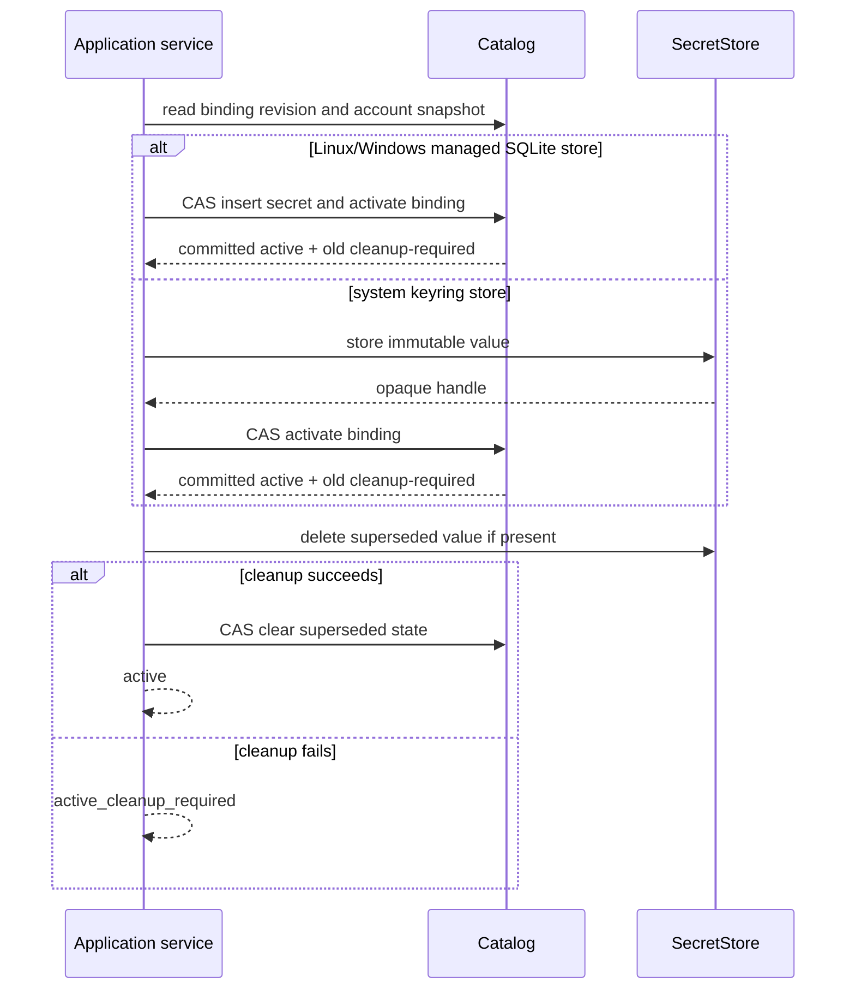

# 05. Credentials and Secret Lifecycle

## Security Objective

Managed secret values are owned only by a `SecretStore`. On Linux and Windows,
the default store is the private managed SQLite database and values reside only
in its dedicated `managed_secret` table. Windows requires spec 08's local fixed
NTFS identity and protected-DACL profile. On macOS, the default store is the
operating-system keyring; SQLite then stores only revisioned binding lifecycle
and opaque internal references. Managed mode never falls back to legacy TOML
plaintext when its selected store is unavailable.

## Sensitive Data Classification

The following are sensitive:

- passwords, app passwords, access/refresh tokens, client secrets, and private
  keys;
- values returned by `SecretStore`;
- values supplied during set, rotation, or import;
- reusable backend locator strings when disclosure would help retrieve a value.

Sensitive data MUST NOT appear in:

- managed SQLite columns other than the dedicated Linux/Windows
  `managed_secret.secret_value` column, migration files, or projection rows;
- MCP schemas, arguments, results, resources, or protocol logs;
- CLI argv, shell history guidance, stdout, or ordinary logs;
- UI URLs, fragments after bootstrap exchange, HTML, JSON responses, browser
  local/session storage, caches, telemetry, or error text;
- application/domain DTOs, repr/equality output, exception messages, test
  snapshots, crash reports, or process-wide settings caches.

Masked placeholders are display-only and are never submitted as values.

## Secret Input Surfaces

Managed values may enter only through:

- an interactive masked CLI prompt or an explicitly documented stdin/FD path
  that does not echo or place the value in argv; or
- an authenticated, CSRF-protected UI JSON mutation body over loopback.

The UI clears credential component state after submission and on navigation or
failure. Responses report state (`configured`, `missing`, `cleanup_required`)
but never return the submitted value.

MCP has no secret input in either mode and exposes no account-management tool.
The historical credential-bearing MCP account-add field is removed. Agent
skills/plugins MUST hand the user to interactive CLI or authenticated local UI
without asking for, receiving, or relaying the value.

## SecretStore Port

The port provides bounded operations to:

- store an immutable value and return an opaque internal handle;
- resolve a specific handle;
- delete a specific value;
- report typed unavailable, missing, denied, malformed, and transient failures.

The Linux/Windows SQLite implementation additionally participates in the
catalog write
transaction so inserting `managed_secret` and activating its binding/revision
are one atomic commit. Implementations MUST avoid value enumeration and broad
lookup. Application code MUST NOT infer success from backend-specific exception
strings.

## Late Resolution

Provider work follows this order:

1. read the selected account's non-secret snapshot;
2. validate request, lifecycle, policy, endpoint, and role;
3. immediately before provider construction, revalidate authority/revision;
4. resolve only the binding for that account and required role;
5. construct the operation-scoped provider and release the application's value
   reference as soon as practical.

Loading settings MUST NOT resolve all enabled accounts. A missing or denied
secret for one unrelated account cannot break startup or an operation on another
account. Startup validates binding metadata; doctor may explicitly resolve a
bounded chosen set.

## Binding Lifecycle

Each endpoint-role binding has revisioned status, conceptually:

```text
missing
active(current)
active(current) + superseded(cleanup required)
```

A failed save does not persist a provisional binding or change binding authority.
Concrete storage may normalize active and cleanup state, but transitions and
recovery must remain observable without exposing handles publicly.

## Set and Rotate Protocol



For Linux and Windows, insertion into `managed_secret`, activation of the new
binding, the
account/binding revision increment, and transition of any old active value to
`CLEANUP_REQUIRED` occur in one SQLite transaction. No external keyring or
network call occurs in that transaction. For a keyring-backed store, the value
is written before one compare-and-swap activation transaction. A conflict or
failure before activation triggers best-effort deletion of that unreferenced
value and returns an error; it never persists a provisional binding and never
changes current binding authority.

Rotation never overwrites the old active value in place. Activation first makes
the new value authoritative and records the superseded old value as
`CLEANUP_REQUIRED`. The service then performs bounded deletion and clears that
state when deletion succeeds. Only an external or follow-up deletion failure
retains cleanup state.

The initiating operation returns one of at least:

- `active`: new credential is active and no known cleanup remains;
- `active_cleanup_required`: new credential is active but a superseded value
  could not be removed;
- `credential_store_unavailable`: the selected store was locked or unavailable
  and binding authority is unchanged;
- typed rejection/conflict before activation, with binding authority unchanged.

Cleanup failure MUST NOT be hidden behind an unconditional success message.

## Remove and Account Removal

Credential removal first makes the binding unusable through a revisioned catalog
transition, then attempts value deletion. Failure leaves cleanup-required state.
Account soft removal disables all new provider work before cleaning role
bindings and retains enough tombstone state for bounded cleanup. Once an
authoritative activation, detachment, or tombstone transaction commits, any
external-store or follow-up SQLite finalization failure returns a typed committed
result with conservative cleanup state; it never reports the mutation as
uncommitted or encourages automatic replay.

A caller cannot remove the last required credential while simultaneously
claiming that an enabled account remains provider-ready; the service either
rejects, disables as an explicit action, or returns an incomplete status.

## Recovery and Cleanup

Doctor and cleanup commands inspect only bounded superseded cleanup state. They
revalidate value ownership and current revision before deletion. They are
idempotent, never delete an active value based only on age/name, and return
per-binding typed outcomes. Failed saves have no separate recovery mutation; a
later attempt is a fresh save. Automatic startup cleanup is limited to work that
can be proven safe; it does not broadly resolve secrets or contact providers.

## Redaction and Observability

Logging uses operation category, stable non-secret account ID, role, and bounded
error code. It does not include usernames when unnecessary, backend locators,
provider strings, request bodies, or values. Sanitization applies on success,
error, timeout, cancellation, and unexpected-exception paths.

Tests use sentinel secrets and recursively scan CLI output, HTTP bodies, logs,
exceptions, snapshots, non-secret SQLite surfaces, and built frontend assets.
Dedicated Linux/Windows `managed_secret` persistence tests instead prove
transaction atomicity, private storage, and absence from every output/projection
surface.
Test fakes must model missing, denied, transient, cleanup, and crash-boundary
failures.

## Acceptance Criteria

1. Managed secret values never persist outside `SecretStore` and are absent from
   all public interfaces, logs, DTOs, errors, browser storage, and every SQLite
   location except the Linux/Windows store's dedicated
   `managed_secret.secret_value`
   column.
2. Startup and normal operations do not resolve unrelated account secrets; one
   broken binding is isolated to the selected account/role or explicit doctor
   scope.
3. Rotation is crash- and concurrency-tested at secret storage, atomic
   activation, old-value cleanup, and finalization; failed saves leave no
   provisional binding and do not change binding authority.
4. The initiating CLI/UI result distinguishes active, cleanup-required, and
   failed unchanged-authority outcomes and never always prints success.
5. Removal disables use before deletion and retains bounded recoverable state on
   external cleanup failure.
6. Concurrent cleanup cannot delete the currently active value or another
   writer's value.
7. Complete MCP catalog tests prove there is no secret or account-management
   input in legacy or managed mode; agent-integration scenarios never collect or
   relay credentials.
8. Sentinel leakage tests cover every response and exceptional path.
9. Native Windows tests prove private SQLite binding lifecycle and late
   resolution while catalog/bootstrap files remain under spec 08's NTFS and
   DACL contract; unavailable or unsupported storage leaves binding and
   authority unchanged and never falls back to legacy TOML plaintext.
