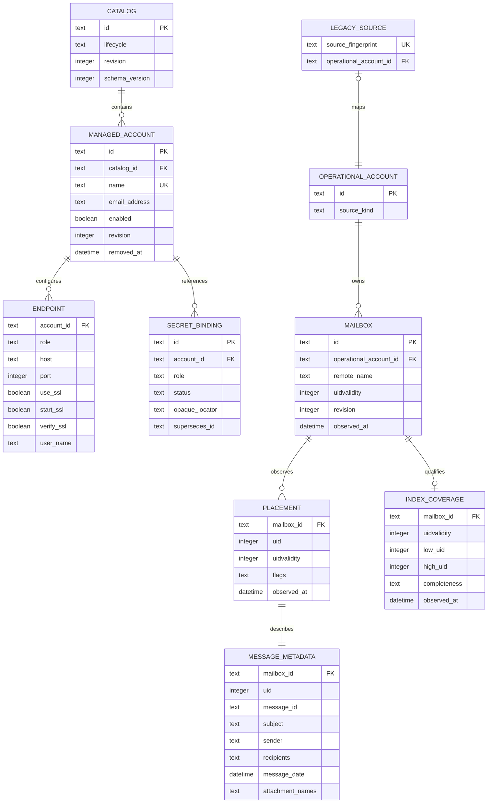

# 05. SQLite Persistence and Data Model

Status: Accepted

Previous: [`04-mail-workflows-and-consistency.md`](04-mail-workflows-and-consistency.md)
Next: [`06-mcp-interface-and-client-compatibility.md`](06-mcp-interface-and-client-compatibility.md)

## Purpose

SQLite owns managed non-secret configuration and a bounded, rebuildable mail
metadata projection. The schema grows only for an active workflow. It is not a
general event store, secret store, mail archive, or distributed transaction
system.

## Stores by Mode

- Managed mode uses the selected secure database for its authoritative catalog
  and operational projection. Failure to open or validate it is fatal.
- Legacy/environment mode may use a configured/default secure operational
  database for stable source identity and index data. Its failure may cause the
  metadata application service to use bounded provider fallback with a warning.
- Index activity never converts legacy rows into managed configuration.

## Minimum Logical Model

The diagram is logical, not a mandate for one table per box. Normalized child
tables or encoded bounded scalar collections are acceptable when constraints
and query behavior remain explicit.

## Managed Configuration

The catalog records `STAGING` or `ACTIVE` and a revision. Account names are
unique among non-removed accounts. Endpoints contain only non-secret protocol
settings. Sender/recipient/path policy needed by managed operations is stored as
explicit durable values; missing required policy in an active catalog fails
closed.

Secret bindings contain opaque references and lifecycle status only. Pending,
active, superseded, and cleanup-required states support the narrow candidate
protocol in [`03-configuration-and-credentials.md`](03-configuration-and-credentials.md).
No secret value, argv copy, backend account name intended for diagnostics, or
provider token is stored in ordinary rows.

Soft-removed accounts retain stable operational identity while credential
cleanup or indexed state requires it. Hard purge is outside the MVP.

## Operational Identity and Index

A managed account and its operational account have stable identity. A legacy or
environment source maps from a stable non-secret source fingerprint to an
operational ID. The fingerprint must not include passwords, tokens, or raw
secret locators.

Mailbox uniqueness is operational account plus canonical remote mailbox name.
Placements are unique by mailbox, UIDVALIDITY, and UID. A UIDVALIDITY change
invalidates old active coverage before rows can answer current queries.

Metadata stores only fields needed by the current public listing result and
supported indexed filters: message ID, subject, sender, recipients, message
date, attachment names/presence, and canonical provider-observed flags. Bodies,
raw MIME, and attachment bytes are not persisted in the MVP.

Coverage records exactly what range and completeness were observed. A recent
window is not complete-mailbox coverage. An exact filtered public total may be
computed from SQLite only when coverage and indexed fields prove the whole
request. Partial refresh never deletes by absence.

## Transactions

- Enable foreign keys and use WAL where supported.
- Use a bounded busy timeout.
- Keep write transactions short and deterministic.
- Perform network, SecretStore, and large filesystem work outside transactions.
- Use optimistic revisions for concurrent account/binding/catalog writes.
- Refresh writes are idempotent upserts scoped to one account/mailbox and
  expected UIDVALIDITY.
- Commit known provider observations without claiming rollback of remote effects.
- Close all connections and statement resources during runtime shutdown.

## Schema and Migration

A schema metadata record identifies a supported version. Migrations are ordered,
transactional where SQLite permits, and idempotently recognized after restart.
A newer unsupported schema, failed migration, corrupt database, or migration
lock timeout produces a typed startup failure in managed mode.

Before the first managed release, unreleased development migrations are
consolidated into the smallest coherent baseline. New migrations require a live
consumer in the same delivery slice; no table is added solely for a deferred UI,
operation engine, backup system, FTS, body cache, or QRESYNC optimization.

## Files and Permissions

The database, WAL/SHM files, lock files, bootstrap files, and parent directory
follow the owner-only, anti-symlink, ownership, and replacement checks in
[`03-configuration-and-credentials.md`](03-configuration-and-credentials.md).
Adapters re-check security before opening existing files and after creating
sidecars where the platform permits. Errors are sanitized.

## Failure Behavior

| Failure                                      | Managed mode                                                | Legacy operational index                                |
| -------------------------------------------- | ----------------------------------------------------------- | ------------------------------------------------------- |
| Missing/non-active catalog                   | fail closed                                                 | not applicable                                          |
| Corrupt/incompatible schema                  | fail closed                                                 | warn and provider fallback for eligible reads           |
| Insecure file/path                           | fail closed                                                 | disable index; provider fallback for eligible reads     |
| Busy timeout                                 | typed failure; no legacy fallback                           | bounded warning and provider fallback for metadata read |
| Projection write failure after provider read | return bounded provider result with stale warning when safe | same                                                    |
| Projection write failure after mutation      | preserve known provider outcome; mark reconciliation needed | same                                                    |

Provider fallback always stays in the application query service. Managed catalog
failures cannot be bypassed because the database owns account authority.

## Retention and Rebuild

Metadata is bounded by configured mailbox/window limits and is rebuildable from
IMAP. Eviction removes only rebuildable projection rows and updates coverage
honestly. The MVP has no unresolved generic operation evidence that requires a
retention ledger. Rebuild never alters managed accounts, policies, secret
bindings, or legacy source configuration.

## Validation

Tests cover constraints, revisions, lifecycle transitions, binding states,
source mapping without secret material, deterministic paging, exact-total
eligibility, UIDVALIDITY invalidation, partial-refresh non-deletion, migration
restart, busy/corrupt/insecure failures, sidecar permissions, concurrent
processes, bounded retention, rebuild isolation, and clean resource shutdown.
