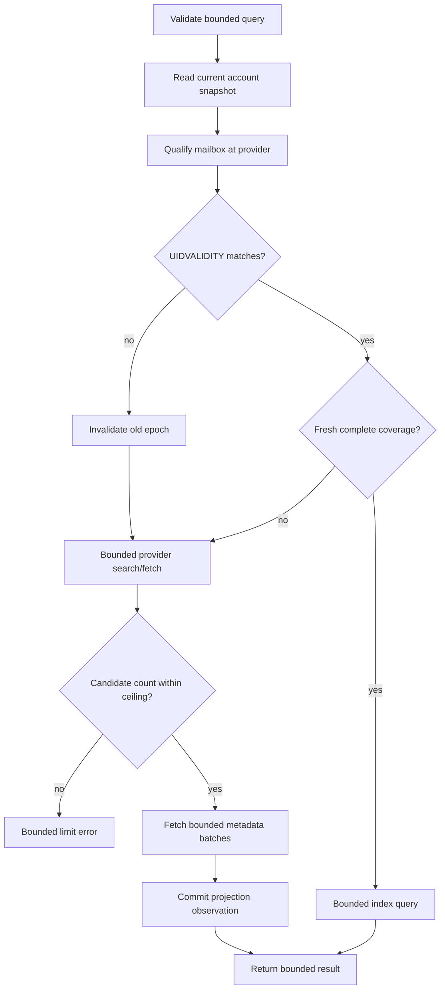

# 06. Mail Read Model and Metadata Index

## Authority and Scope

IMAP is authoritative for mailbox membership, placement, flags, and message
metadata. SQLite is a bounded projection that can reduce provider work. It is
never a complete offline mailbox and may be rebuilt without changing provider
truth.

Read workflows are mailbox discovery, metadata listing/search, body retrieval,
and attachment materialization. Each begins from a current operational account
snapshot and uses late credential resolution from spec 05.

## Mailbox Discovery

The public mailbox value contains only:

- canonical provider mailbox name;
- hierarchy delimiter when supplied;
- provider flags or attributes as bounded strings.

IMAP LIST does not prove UIDVALIDITY, UIDNEXT, message count, or observation time,
so those values MUST NOT be represented as discovery facts. They belong to a
separate selected-mailbox metadata observation when explicitly queried.

Mailbox discovery enforces both a count ceiling and aggregate normalized byte
ceiling. A provider response exceeding either is rejected or explicitly
truncated according to the public contract; it is never accumulated without
bound. Mailbox names are treated as data and quoted safely for later commands.

## Durable Placement and Qualification

A projection placement key is:

```text
account ID + canonical mailbox + UIDVALIDITY + UID
```

Before using cached rows, the service qualifies the logical mailbox with current
provider state. UIDVALIDITY mismatch invalidates the prior epoch before its rows
can answer the request. The current public numeric email ID remains a
compatibility UID-like value and is not advertised as epoch-bound provenance.

A logical mailbox observation records bounded qualification and coverage data,
such as current UIDVALIDITY, observation time, highest covered UID/range, and
whether the relevant query domain is complete. These are metadata-index facts,
not fields promised by mailbox LIST.

## Coverage and Exactness

An exact total or absence conclusion may come from the projection only when:

1. account and logical mailbox match;
2. current UIDVALIDITY matches the projected epoch;
3. freshness is within configured policy;
4. coverage is complete for the requested filter and range;
5. no stale marker overlaps the requested domain.

Otherwise the service queries IMAP, returns a provider-qualified result, and
updates the projection only with evidence actually observed. Partial scans,
bounded windows, failed refreshes, or interrupted fetches never delete rows by
absence and never produce an exact total claim.

## Metadata Query Flow



Provider candidate identifiers are canonicalized, deduplicated, sorted where
required, and rejected above a strict ceiling before metadata fetch. Basic IMAP
SEARCH has the documented pre-cardinality residual: it receives a command
deadline and its complete UID response is size/count checked immediately before
any further work.

Headers, address lists, subjects, snippets, flags, provider errors, and aggregate
serialized results each have limits. Oversized fields are rejected or truncated
with an explicit marker according to their contract; silent unlimited copying is
forbidden.

## Body Retrieval

Body reads:

- accept a bounded non-empty identifier collection, with a public maximum of 500
  and potentially stricter aggregate limits;
- preserve caller order and return per-item typed outcomes;
- use IMAP PEEK semantics and do not mark messages read as a side effect;
- bound per-message and aggregate fetched bytes before parsing and serialization;
- sanitize decode/parser errors and never persist bodies or raw MIME in SQLite.

Marking read is a separate mutation under spec 07.

## Attachment Retrieval and Exact Destination

Attachment materialization is an explicit local filesystem effect. The caller
supplies the exact destination path. Compatibility requires preserving that
path; the service MUST NOT silently rewrite it into an approved workspace,
rename it, or append a provider filename.

The effect is permitted only when:

1. attachment retrieval is explicitly enabled by current policy;
2. account authority and policy are freshly revalidated;
3. account, mailbox, message, and MIME part identifiers are valid and bounded;
4. declared and actual bytes fit per-attachment and aggregate ceilings;
5. the provider never receives or interprets the local path;
6. every existing path component and final target passes no-follow checks;
7. symlink, non-regular target, unsafe ownership/permissions, directory
   substitution, and replacement races are rejected;
8. bytes are written with owner-only permissions using an atomic/no-clobber
   strategy consistent with the declared overwrite contract;
9. final identity, type, owner, permissions, and size are revalidated before
   success is returned.

The result reports the exact requested destination in a bounded local-only
response. Logs and remote/provider errors do not include it. Partial files are
removed when their identity can be proven; otherwise the operation returns a
bounded cleanup warning without deleting an unverified path.

## Index Writes and Failures

Projection writes occur after provider reads and outside provider sessions when
possible. A provider-qualified result remains usable if projection persistence
fails; the response adds a bounded projection warning. Busy, corrupt, insecure,
or incompatible index state never causes fabricated cached data or legacy-mode
fallback.

Retention limits rows, header bytes, accounts/mailboxes per maintenance pass,
and deletion batches. Rebuild affects only projection tables and never managed
catalog authority or secret binding state.

## Acceptance Criteria

1. Mailbox discovery is bounded by count and aggregate bytes and exposes only
   name, delimiter, and attributes.
2. UIDVALIDITY changes prevent prior-epoch rows from answering current queries.
3. Exact totals require fresh qualified complete coverage; partial absence never
   deletes or proves absence.
4. Candidate UID count, fetch batches, headers, bodies, parser work, errors, and
   serialized results have enforced ceilings, including direct service calls.
5. Body reads use PEEK, preserve input order, and return per-item outcomes for up
   to the documented limit without persisting content.
6. Attachment tests cover explicit enablement, exact path preservation, size
   limits, symlinks, non-regular targets, permissions, no-clobber/overwrite,
   replacement races, partial cleanup, and absence of path leakage to provider.
7. Projection failure cannot turn known provider read evidence into a false mail
   failure, and rebuild cannot alter catalog or credential state.
