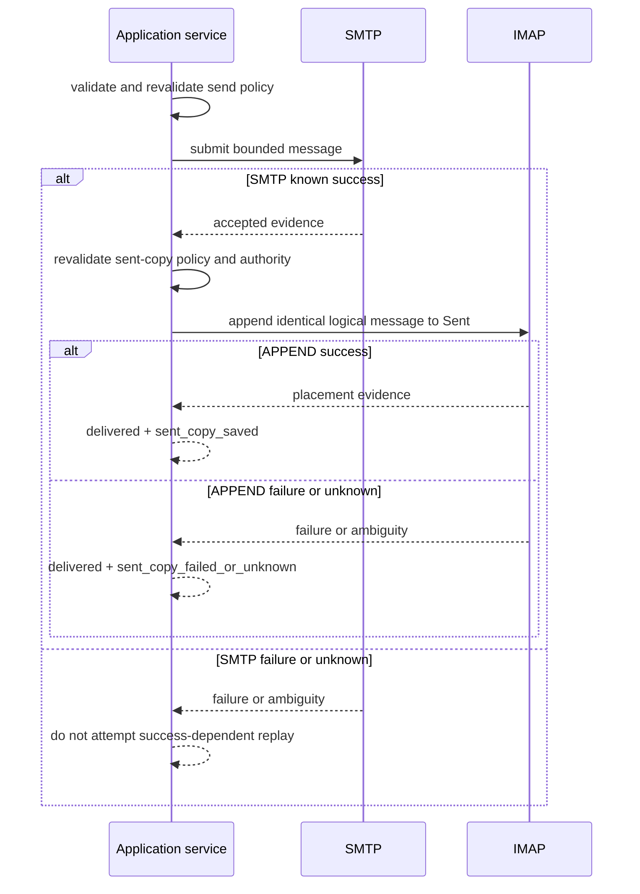

# 07. Mail Mutations and Provider Effects

## Effect Model

Mail mutations cross authority boundaries. SQLite cannot make an IMAP or SMTP
effect atomic with local persistence. Each workflow therefore identifies its
independent provider effects, revalidates authority before each, records the
available protocol evidence, and returns per-target success, failure, unknown,
or success-with-warning.

Mutation policy is deny-by-default for protected effect classes. The management
UI in this delivery exposes no mail mutation route.

## Common Mutation Pipeline

For each target, in caller order:

1. validate all request and aggregate limits;
2. read and validate the current account, mailbox, and effective policy;
3. qualify current provider state and required capability;
4. check cancellation before the effect begins;
5. resolve only the required selected-account secret and construct the provider;
6. execute one bounded provider effect;
7. classify protocol evidence without guessing;
8. update or invalidate the metadata projection in a separate local phase;
9. preserve provider success if projection work fails, adding a bounded warning.

Independent targets continue or stop according to the documented per-tool
policy, but already completed effects are never rolled back fictionally. Results
preserve input order.

## Public Numeric IDs

Existing public message IDs identify the current mailbox UID for compatibility.
They do not carry the UIDVALIDITY observed during a prior listing. Before a
mutation the service selects the current account/mailbox, obtains current
UIDVALIDITY where feasible, and avoids using stale projected placement as proof.
It does not claim to detect every listing-epoch race. An epoch-bound public
identifier requires a future versioned contract.

## Flags and Mark Read

Flag updates use UID-scoped IMAP commands and bounded batches. Mark-read and
mark-unread are explicit mutations separate from body reads. Per-target evidence
comes from tagged protocol completion and, where required, bounded verification.
Partial target outcomes are returned individually.

## Save or Append

Saving a message to a mailbox is an IMAP APPEND effect. The request bounds
headers, recipients, subject, body, encoded message bytes, and destination.
Success requires positive APPEND evidence. If APPEND succeeds but UID mapping or
projection update is unavailable, the result remains success with an unknown
placement/projection warning rather than resubmitting.

## Move and Archive

A move uses native UID MOVE when the provider advertises and supports it. A
fallback may use UID COPY followed by a deletion/expunge sequence only when the
provider offers a scoped primitive that cannot expunge unrelated messages.

Archive resolves an explicit destination policy and then follows the same move
contract. Destination creation, if supported, is a separate effect with its own
policy and evidence; it is not silently attempted after an unsafe fallback.

## Delete and Scoped Expunge

Delete marks only selected UIDs and removes only those targets with a scoped
provider primitive. Allowed strategies are:

- native UID MOVE to trash under explicit policy;
- UID STORE plus UID EXPUNGE when UIDPLUS/scoped expunge is available;
- another provider primitive proven to affect only requested targets.

Bare mailbox-wide `EXPUNGE` is forbidden. If a provider lacks a safe scoped
primitive, the operation rejects before marking any message deleted. It MUST NOT
attempt an unsafe best effort.

## SMTP Delivery and Sent Copy

SMTP delivery and IMAP sent-copy APPEND are independent effects:

A sent-copy failure MUST NOT trigger SMTP resubmission. The result separately
reports delivery and sent-copy outcomes. If SMTP is unknown, automated replay is
forbidden; operator reconciliation is required.

Message-ID or other local identifiers can aid reconciliation but do not create
exactly-once guarantees.

## Authority Changes Between Effects

Before sent-copy, destination creation, or another independent effect, the
service re-reads current account lifecycle, endpoint/binding revision, and policy.
If authority was disabled or tightened after SMTP success, the secondary effect
is skipped with an explicit policy/authority outcome while SMTP success remains
reported.

## Timeouts, Cancellation, and Ambiguity

Deadlines bound connection and protocol commands where the provider adapter can
enforce them. Cancellation before an effect yields cancelled/no-effect. Once
bytes or a mutation command may have reached a provider, interrupted evidence is
classified unknown unless the protocol proves success or failure.

Retries are allowed only for operations proven idempotent under the same current
authority and request identity. Non-idempotent APPEND, SMTP delivery, move, or
delete is not automatically replayed after unknown.

## Result Bounds and Error Safety

Mutation requests bound target count, address count/bytes, headers, body, total
encoded bytes, mailbox names, and batch size. Results bound per-target details,
warnings, provider-code normalization, and aggregate serialization. Raw provider
responses, message content, credentials, stack traces, and uncontrolled local
paths do not enter public errors.

## Acceptance Criteria

1. Every mutation revalidates current authority before each independent provider
   effect and resolves only the needed account/role secret.
2. Per-target results preserve caller order and distinguish success, failure,
   unknown, cancelled-before-effect, and local projection warning.
3. Body retrieval does not mark read; explicit bounded mark-read does.
4. Move/archive/delete use native or proven scoped primitives, and tests prove no
   code path issues bare `EXPUNGE` or marks deleted before rejecting unsafe
   capability.
5. Provider success remains success when projection persistence fails.
6. SMTP and sent-copy outcomes are independently represented, and sent-copy
   failure/unknown never causes SMTP replay.
7. Cancellation and timeout tests cover before-effect, known-after-effect, and
   ambiguous boundaries for IMAP and SMTP.
8. Public numeric IDs are documented and tested as current-mailbox compatibility
   IDs, not durable listing-epoch tokens.
9. No management UI route can invoke mail mutations in this delivery.
