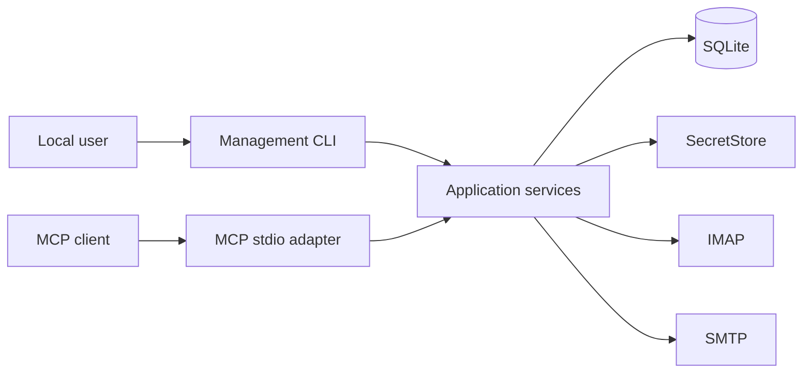

# Local Email App Architecture

Status: Accepted

This directory defines the accepted MVP architecture for evolving
`mcp-email-server` into a local, single-user Email App. `Accepted` means the
contract is approved; it does not claim that every part is implemented. Shipped
behavior remains documented under [`docs/`](../docs/).

## Product Contract

- The product runs for one operating-system user on one machine.
- stdio is the target MCP transport. Existing HTTP, SSE, and Gradio commands are
  compatibility surfaces until a separate retirement decision is made.
- MCP and CLI are thin adapters over shared application services.
- An explicit bootstrap mode selects either `legacy` or `managed` operation.
- Managed non-secret configuration and reusable mail metadata live in SQLite.
- Passwords, tokens, and provider keys live in a `SecretStore`; SQLite stores
  only opaque bindings.
- Legacy TOML, environment composition, and keyring behavior remain a supported
  compatibility mode and an explicit import source.
- IMAP is authoritative for mailboxes, messages, and flags. SQLite is a bounded,
  freshness-qualified projection.
- SMTP acceptance is authoritative for delivery. Local sent-copy failure cannot
  roll back a successful send.
- Public MCP behavior remains compatible unless a separately versioned proposal
  explicitly changes it.

## Architecture

The application core does not import FastMCP, Typer, SQLite drivers, keyring
libraries, or concrete mail clients. Ports are introduced only for active
external boundaries or deterministic test seams.

## MVP Scope

The first managed release provides:

1. explicit managed-store initialization, account setup, connectivity testing,
   activation, and mode selection through CLI;
2. managed account resolution through the existing stdio MCP server;
3. one bounded metadata-index path with application-owned provider fallback;
4. existing read and mutation workflows moved behind application services;
5. account update, disable/re-enable, soft removal, credential rotation, legacy
   import, diagnostics, and clean process shutdown;
6. deterministic unit, contract, and loopback GreenMail E2E coverage.

## Deferred Proposals

The MVP does not require a daemon, background sync, React UI, MCP App, new remote
transport, generic operation engine, generic continuity ledger, online backup or
restore, hard purge, QRESYNC/VANISHED optimization, full-text search, persistent
body cache, raw MIME store, or persistent attachment store. A concrete need and
separate accepted spec are required before adding any of them.

## Spec Map

1. [`01-system-context.md`](01-system-context.md) — actors, process model, trust
   boundaries, goals, and non-goals.
2. [`02-application-boundaries.md`](02-application-boundaries.md) — layers,
   composition, ports, service ownership, and failure boundaries.
3. [`03-configuration-and-credentials.md`](03-configuration-and-credentials.md)
   — explicit mode selection, managed lifecycle, legacy compatibility, secrets,
   import, and filesystem security.
4. [`04-mail-workflows-and-consistency.md`](04-mail-workflows-and-consistency.md)
   — indexed reads, provider fallback, body access, mutation safety, and
   workflow-specific uncertain outcomes.
5. [`05-sqlite-persistence-and-data-model.md`](05-sqlite-persistence-and-data-model.md)
   — minimum logical schema, transactions, coverage, migrations, and failure
   behavior.
6. [`06-mcp-interface-and-client-compatibility.md`](06-mcp-interface-and-client-compatibility.md)
   — stable stdio catalog, existing metadata contract, result bounds, and
   client validation.

## Sources of Truth

| Data                                     | Authority                            | Local role                                                |
| ---------------------------------------- | ------------------------------------ | --------------------------------------------------------- |
| Bootstrap mode and managed DB path       | bootstrap configuration              | selects startup mode only                                 |
| Managed non-secret account configuration | SQLite                               | authoritative catalog                                     |
| Legacy account configuration             | TOML plus environment composition    | active only in legacy mode                                |
| Managed secrets                          | `SecretStore`                        | secret authority; SQLite has opaque binding state         |
| Legacy secrets                           | configured legacy credential backend | unchanged compatibility behavior                          |
| Mailbox membership, metadata, and flags  | IMAP                                 | SQLite holds rebuildable observations                     |
| SMTP delivery                            | SMTP response                        | application reports acceptance, rejection, or uncertainty |

## Cross-cutting Invariants

- A selected managed mode never falls back to legacy automatically.
- Network and secret-store calls never run inside SQLite transactions.
- Every provider operation resolves an enabled account and validates policy
  immediately before access.
- A placement identity is account, mailbox, UIDVALIDITY, and UID; UID alone is
  not durable.
- Partial refresh never proves deletion by absence.
- Body reads use PEEK unless the caller explicitly requests a read mutation.
- A scoped delete or move fallback never uses mailbox-wide bare `EXPUNGE`.
- Ambiguous provider effects are reported as unknown and are not automatically
  retried.
- Secrets never appear in ordinary database fields, argv, logs, diagnostics,
  MCP results, or documentation examples.
- All application queries, subsequent local work, batches, bodies, diagnostics,
  and error details have explicit bounds. Basic IMAP SEARCH's pre-cardinality UID
  response is the sole accepted provider-payload exception and is constrained by
  timeout plus the post-response ceiling in spec 06.
- The tool catalog is stable for one stdio session; account capability changes
  are represented by data and call-time validation.

## Status Vocabulary

| Status        | Meaning                                            |
| ------------- | -------------------------------------------------- |
| `Proposed`    | Under discussion; no implementation claim.         |
| `Accepted`    | Approved target; implementation may be incomplete. |
| `Implemented` | Backed by code, tests, and aligned published docs. |
| `Superseded`  | Replaced by a linked decision or spec.             |
